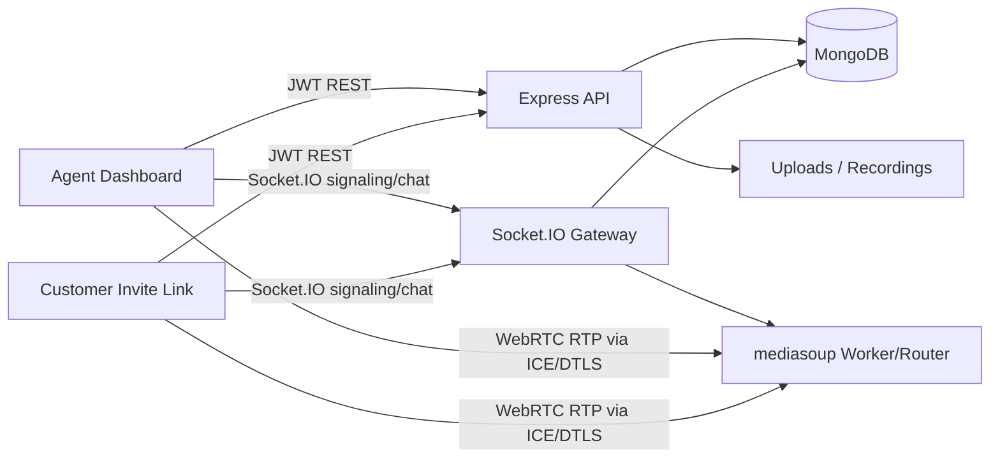

# Real-Time Video Support Platform

Production-ready starter for customer support teams using Next.js 15, Express, MongoDB, Socket.IO, mediasoup, JWT auth, Zustand, and Docker Compose.

## Architecture



## Features

- Agent/customer/admin roles with JWT authentication and RBAC middleware.
- Agent dashboard for creating sessions, joining calls, copying invite links, ending sessions, and toggling recording metadata.
- Customer invite flow at `/session/:inviteCode`.
- mediasoup-routed WebRTC. Media is produced to and consumed from the SFU, not peer-to-peer.
- Socket.IO chat with MongoDB persistence and chat history hydration on join.
- MongoDB models: `User`, `Session`, `Participant`, `ChatMessage`, `Recording`.
- Reconnect handling with a 30-second participant grace period.
- Secure upload endpoint with MIME and size limits.
- Metrics API at `GET /api/admin/metrics`.
- Docker and Docker Compose deployment skeleton.

## Local Setup

```bash
cp backend/.env.example backend/.env
cp frontend/.env.example frontend/.env.local
npm install
docker compose up --build
```

Open:

- Frontend: `http://localhost:3000`
- Backend health: `http://localhost:4000/health`

For local development outside Docker:

```bash
npm install
npm run dev:local
```

Run MongoDB locally or update `backend/.env`.

## API Summary

- `POST /api/auth/register`
- `POST /api/auth/login`
- `GET /api/auth/me`
- `POST /api/sessions`
- `GET /api/sessions`
- `GET /api/sessions/invite/:inviteCode`
- `GET /api/sessions/:id/history`
- `POST /api/sessions/:id/end`
- `GET /api/chat/:sessionId`
- `POST /api/recordings/:sessionId/start`
- `POST /api/recordings/:sessionId/stop`
- `POST /api/uploads`
- `GET /api/admin/metrics`

## Socket Events

- `session:join`
- `chat:send`, `chat:message`
- `mediasoup:createTransport`
- `mediasoup:connectTransport`
- `mediasoup:produce`
- `mediasoup:newProducer`
- `mediasoup:consume`
- `mediasoup:resumeConsumer`
- `call:mediaState`
- `participant:update`

## Production Notes

- Replace all example secrets and set `JWT_SECRET` to a long random value.
- Set `MEDIASOUP_ANNOUNCED_IP` to the public IP or DNS-resolved host of the mediasoup server.
- Open the configured RTP port range in your firewall and load balancer.
- Put HTTPS in front of both frontend and backend. Browser camera/microphone access requires secure origins outside localhost.
- The recording service currently persists recording lifecycle metadata. In production, attach mediasoup PlainTransports to FFmpeg/GStreamer workers to mux actual media files.
- Store uploads and recordings in object storage with signed URLs when deployed across multiple instances.
